 
            

居委生活垃圾分类全程监管平台用户手册

 
 
 
 

 
           

Ver 1.0

2022-07-25

上海皓维电子股份有限公司

            

----------
 

目录

-	[前言](#preface)
	-   [版本需求](#preface-1)
-	[一、 登录平台](#1)
-	[二、生活垃圾分类监管平台](#2)
	-	[2.1 平台名称](#2-1)
	-	[2.2 公告栏 ](#2-2)	
	-	[2.3 时间、账号、说明书 ](#2-3)	
		-	[2.3.1 修改密码](#2-3-1)
		-	[2.3.2 绑定新手机](#2-3-2)
		-	[2.3.3 更换绑定手机](#2-3-3)
	-	[2.4 投放点列表](#2-4)	
   -	[2.5 投放点信息](#2-5)
   -	[2.6 数据统计](#2-6)
		-   [2.6.1 全部设备](#2-6-1)
		-   [2.6.2 在线设备](#2-6-2)
		-   [2.6.3 离线设备](#2-6-3)
		-   [2.6.4 投放点](#2-6-4)
		-   [2.6.5 垃圾落地](#2-6-5)
		-   [2.6.6 混合投放](#2-6-6)
		-   [2.6.7 滞留投放点](#2-6-7)
		-   [2.6.8 满溢投放点](#2-6-8)
   -	[2.7 投放点设备监控视频](#2-7)
   -	[2.8 滞留垃圾事件概况](#2-8)
   -	[2.9 垃圾落地排名/混合投放排名](#2-9)
   -	[2.10 垃圾滞留时长排名](#2-10)
   -	[2.11 垃圾落地/混合投放事件](#2-11)
-	[三、汇总信息](#3)
	-	[3.1 日期，日报表/月报表，导出数据](#3-1)
	-	[3.2 主要指标](#3-2)
	-	[3.3 滞留任务处置](#3-3)
	-	[3.4 事件占比](#3-4)
	-	[3.5 垃圾落地/混合投放](#3-5)
	-	[3.6 投放点事件](#3-6)
	-	[3.7 月报表](#3-7)
		-   [3.7.1 垃圾落地](#3-7-1)
		-   [3.7.2 混合投放](#3-7-2)

		
----------
 

前言

浏览器需求

chrome支持 5.0 及以上或microsoft edge
  

<b>一、 登录平台</b>

平台访问地址:
默认地址：[http://garbage01.51hws.cn/](http://garbage01.51hws.cn/ "http://garbage01.51hws.cn/")  
  

<b>输入用户名和密码，登陆系统。</b>
 
 

<b>二、生活垃圾分类监管平台</b>

<b>点击进入生活垃圾分类监管平台主页；</b>
 
 
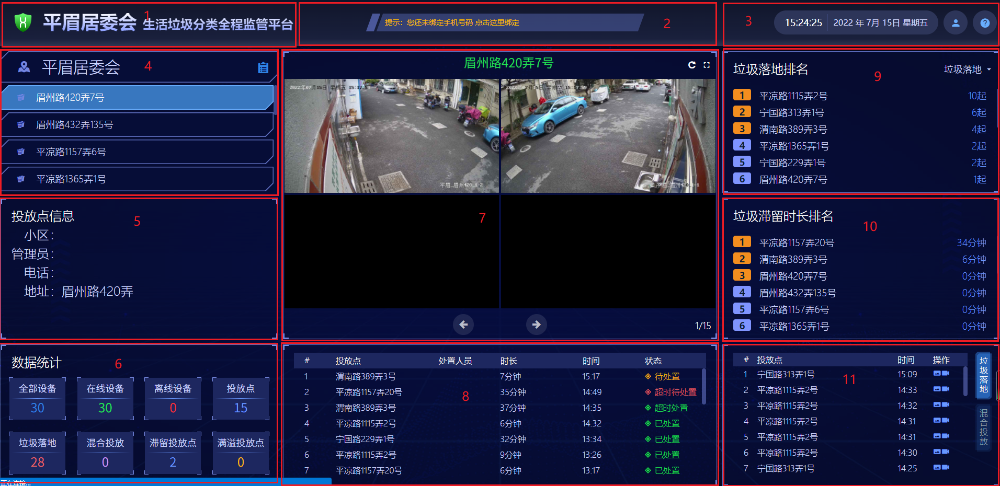 
 
<b>**2.1  平台名称**</b> 
<b>**2.2  公告栏**</b> 
<b>**2.3  时间、账号、说明书**</b> 
<b>**2.4  投放点列表**</b> 
<b>**2.5  投放点信息**</b> 
<b>**2.6  数据统计**</b> 
<b>**2.7  投放点设备监控视频**</b> 
<b>**2.8  滞留垃圾事件概况**</b> 
<b>**2.9  垃圾落地排名/混合投放排名**</b> 
<b>**2.10 垃圾滞留时长排名**</b> 
<b>**2.11 垃圾落地/混合投放事件**</b> 

 

<b>2.1 平台名称</b>

平台名称-平眉居委会 生活垃圾分类全程监管平台 

 
 

<b>2.2 公告栏</b>

公告栏-点击提示信息，进行手机号码的绑定。 

 

跳转至绑定手机页面。 

 
 

<b>2.3 时间、账号、说明书</b>

时间、账号、说明书 

 

账号-显示账号、修改密码、绑定新手机、退出登录按钮。 

点击  弹出账号下拉菜单： 

 
 

 

<b>2.3.1 修改密码</b>

点击修改密码，弹出修改密码框。 

输入原密码进行验证。验证通过后，输入新密码，并再次确认密码。 

填写完毕后，点击修改后成功修改密码或点击取消，放弃修改密码。 

 

 

<b>2.3.2 绑定新手机</b>

点击绑定新手机 输入需要绑定的手机号码。 

点击获取验证码等待手机收取短信，在收到短信验证码（有效时间为5分钟）后，将已获取到的验证码输入到验证码框中。 

然后点击绑定按钮进行手机绑定或点击取消按钮取消操作。 

 

 

<b>2.3.3 更换绑定手机</b>

点击绑定新手机 弹出验证已绑定的手机验证码弹窗。 

点击获取验证码，将收到的验证码后输入验证码框中进行解绑。 

点击验证或取消。 

 

点击验证后，跳转至绑定新手机弹窗，重新进行绑定。 

 

 

<b>2.4 投放点列表</b>

用来选择投放点。 

以平眉居委会为例:下辖15个投放点，通过下拉或滑动选择，点击查看投放点相关的视频。  

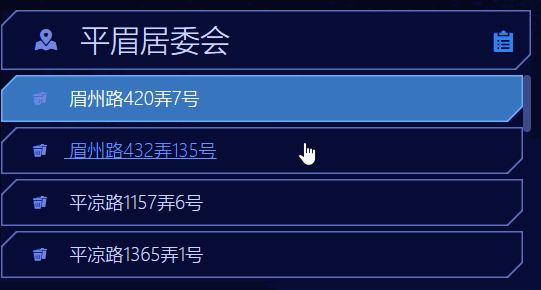  

点击选择眉州路420弄7号投放点，会显示该投放点信息，并展示该投放点设备数量和视频预览。 

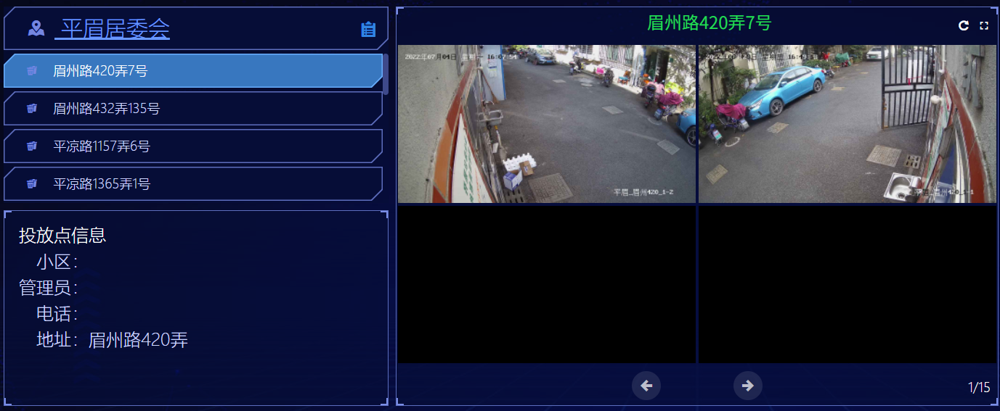 

  

<b>2.5 投放点信息 </b>

显示投放点的小区名字，管理员，电话和地址信息 

 
 
 

<b>2.6 数据统计 </b>

此图显示该居委下设备数量，设备状态，投放点数量，垃圾状态等数据： 

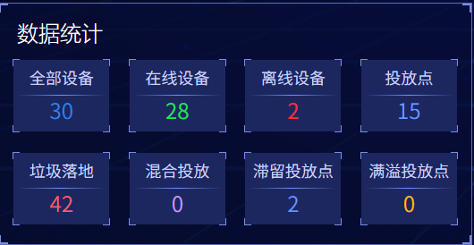 
  

<b>2.6.1 全部设备 </b>

点击，弹出设备信息列（垃圾设备平台的设备主要是摄像机）。 

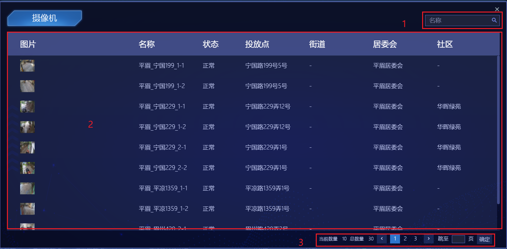 

1. 搜索栏 

2. 摄像机信息 

3.  跳转/翻页区域 
 

<b>2.6.1.1  搜索栏 </b>

点击，输入需要查询的信息，例如： 

`平眉_宁国199_1-1 `，点击查询。获得信息如下： 

 
 

<b>2.6.1.2  摄像机信息 </b>

显示摄像机的预览图片，名称，状态（正常/异常），投放点的名称，所属街道、居委会和社区。 

点击摄像机的预览图，获取摄像机操作页面，可以下载预览图和预览摄像机的功能。 

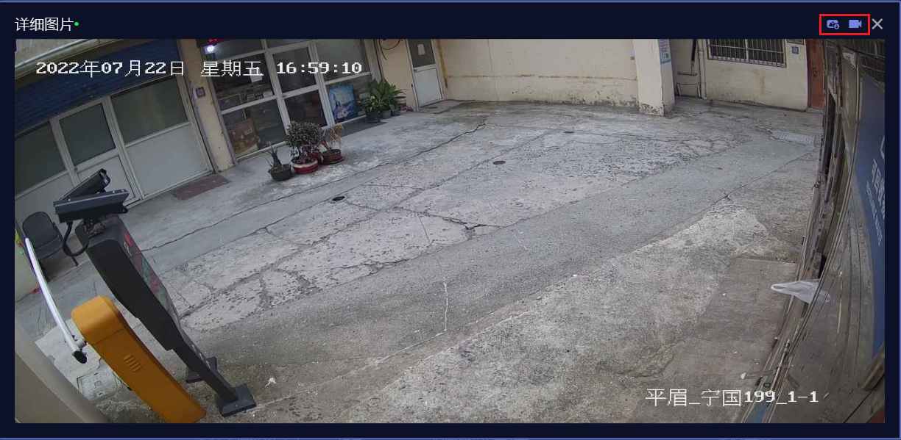 

  下载图片 

  预览视频 

预览截图 

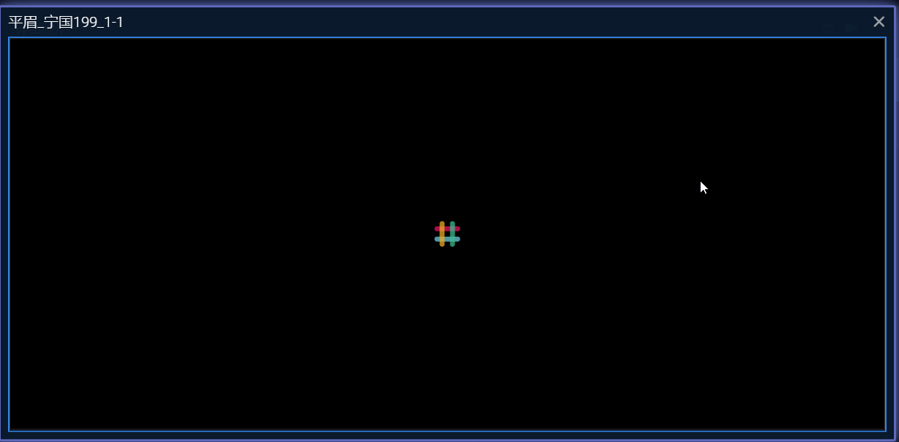 

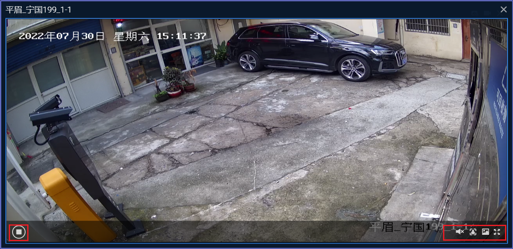 

  停止 

    音量/目标/截图/全屏 

 

<b>2.6.1.3  设备数量/翻页区域 </b>

		

如下图所示：此页面显示的摄像机数量为10台，总数量30台。 

 

   上一页 

   下一页 

   跳转至精确页码 

   确定 

 

<b>2.6.1.4  图片 </b>

点击图片，放大图片。 

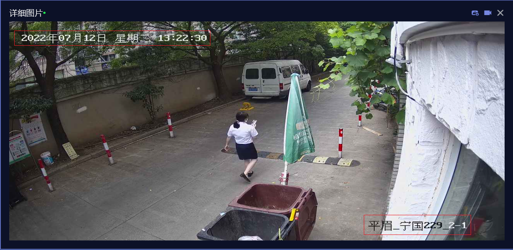 

   

<b>2.6.2 在线设备 </b>

 

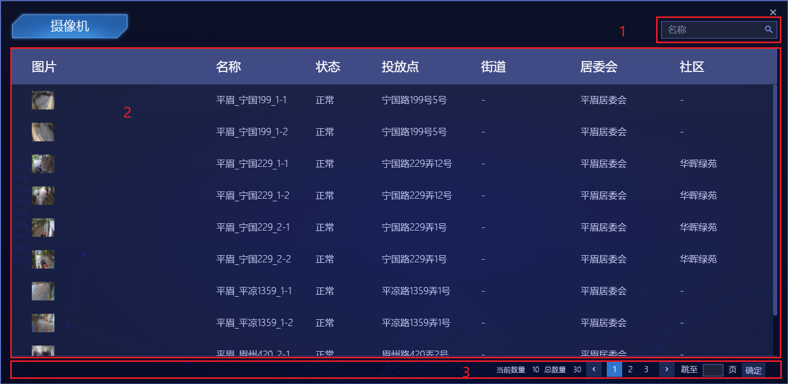 

1. 搜索栏
   参见全部设备下[搜索栏](#2-6-1-1) 

2. 在线设备信息 

3. 设备数量/翻页区域
   参见全部设备下[设备数量/翻页区域](#2-6-1-3) 

此弹窗部分，显示投放点下的在线摄像机（状态正常）名称，投放点、街道、居委和社区的名称。 

点击图片弹出详细图片，操作参考全部设备下的[图片](#2-6-1-4)

  

<b>2.6.3 离线设备 </b>

 

 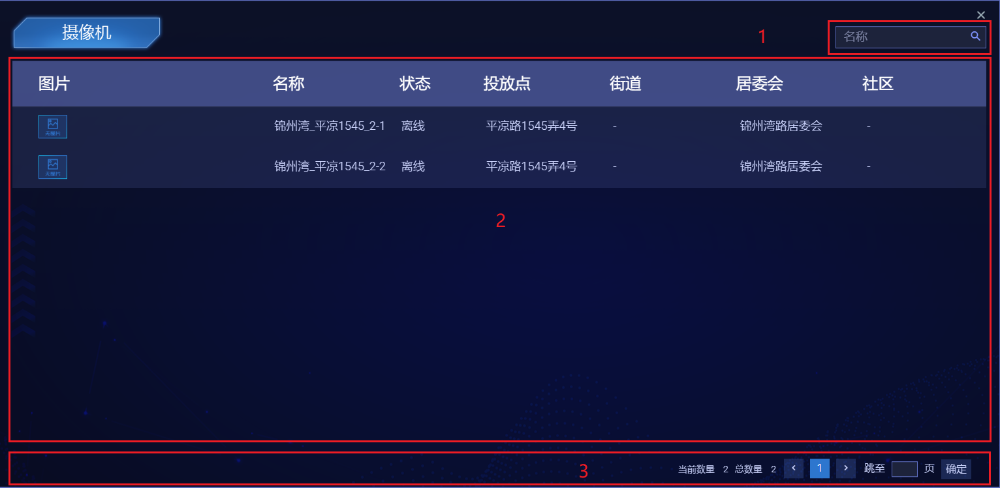

1. 搜索栏
   参见全部设备下[搜索栏](#2-6-1-1) 

2. 在线设备信息 

3. 设备数量/翻页区域
   参见全部设备下[设备数量/翻页区域](#2-6-1-3) 

此弹窗部分，显示投放下离线摄像机（状态离线）名称，投放点、街道、居委会、和社区的名称。 

点击图片弹出详细图片，操作参考全部设备下的[图片](#2-6-1-4)

 

<b>2.6.4 投放点 </b>

   

点击图片 

 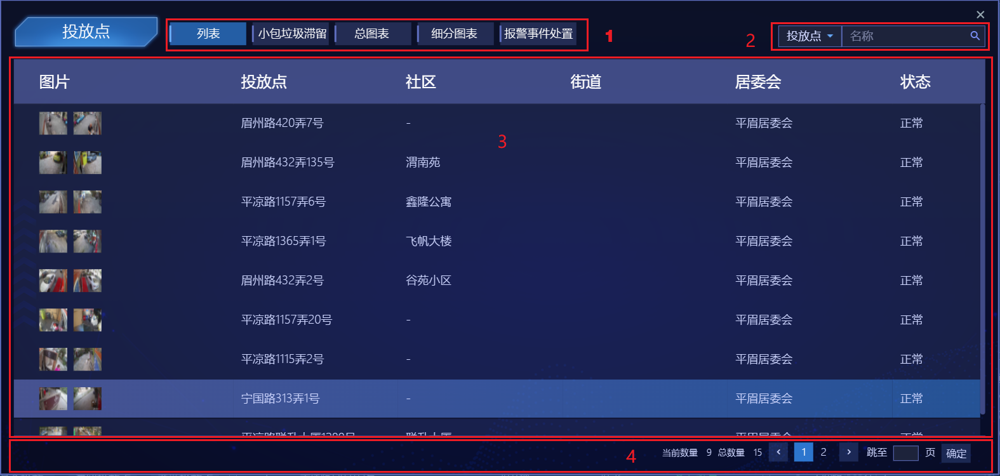  

1.  投放点列表 

2.  搜索栏 
   参见全部设备下[搜索栏](#2-6-1-1) 

3.  投放点信息区域 

4.  设备数量/翻页区域
   参见全部设备下[设备数量/翻页区域](#2-6-1-3) 

注：此页图片的显示该投放点内所有摄像机。 

全部设备、在线设备、离线设备下的预览图片都是一张，投放点下的预览图片是两张。 

 

搜索栏的条件可以切换投放点/社区，输入投放点名称或社区名称，点击搜索按钮。 

搜索投放点名称效果图。 

 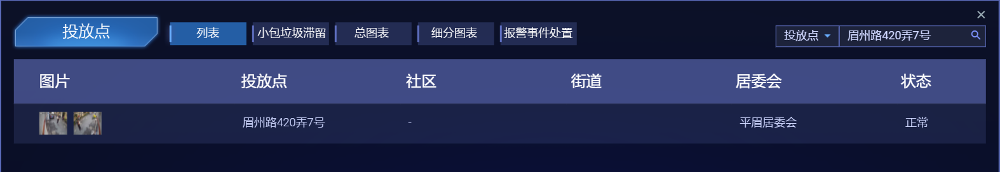 

搜索社区名称效果图。 

  

 

<b>2.6.4.1  投放点列表 </b>

  

列表：该居委下辖的投放点名称，所有设备的预览图，所属社区，所属街道，所属居委，投放点状态。 

  

点击图片  ，放大摄像机预览图片 

 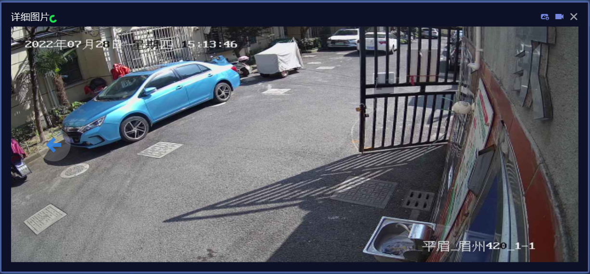 

点击图片  ，上一张图片。 

点击图片  ，下一张图片。 
 

<b>2.6.4.2  小包垃圾滞留 </b>

小包垃圾滞留：查询投放点12小时内小包滞留垃圾的统计数据。 

 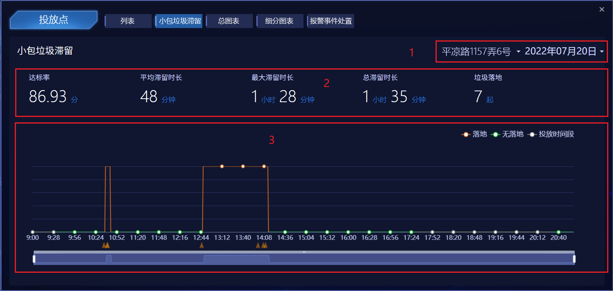 

	 	1.  功能栏
		2.  小包垃圾滞留汇总信息
		3.  小包垃圾滞留数据图

2.6.4.2.1 功能栏 

点击  选择投放点。操作参见：[3.1](#3-1)。 

点击  选择日/月/年。操作参见：[3.1](#3-1)。 

2.6.4.2.2 小包垃圾滞留汇总信息 

  

达标率：720分钟（当天小包垃圾滞留统计时间）- 总滞留时长 / 720分钟。  
平均滞留时长：统计时间内（9：00-21：00），小包垃圾滞留任务总时长/小包垃圾滞留任务总数。 
最大滞留时长：统计时间内（9：00-21：00），小包垃圾滞留任务中，最大滞留任务的时长。 
总滞留时长：统计时间内（9：00-21：00），小包垃圾滞留任务的总时长。 
垃圾落地：统计时间内（9：00-21：00），统计的垃圾落地任务的总数。 

2.6.4.2.3 小包垃圾滞留数据图 

 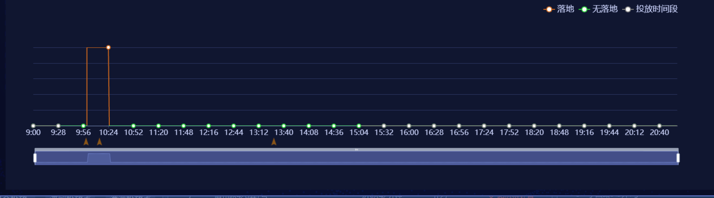 

小包垃圾落地时间段 

如下图，09：56分-10：24分为小包垃圾落地时间段。 

 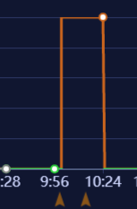 

点击小图标  打开视频弹框。 

  

鼠标移至落地时间段上方，可以预览小包垃圾滞留的相关信息。 

 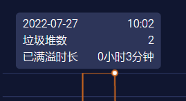 

小包垃圾无落地时间段 

  

时间缩放条 

  

点击  左右拉升时间条。
 
 

<b>2.6.4.3  总图表 </b>

切换总图表页面。 

 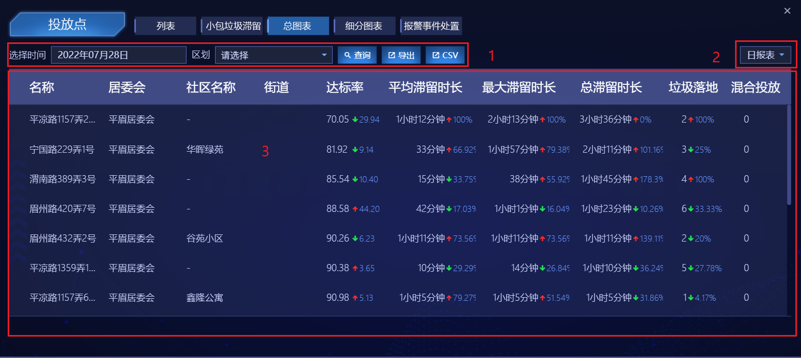 

1.功能栏，操作参见：[3.1](#3-1) 

2.日报表/周报表/月报表 

3.总图表的详细信息 

列举居委下投放点的垃圾落地的详情，以及同比增长率和同比下降率。
 

评分排序功能，下图中的小三角可以切换正序或倒叙 

  

平均滞留时长排序功能，下图中的小三角可以切换正序或倒叙 

  

最大滞留时长排序功能，下图中的小三角可以切换正序或倒叙 

  

总滞留时长排序功能，下图中的小三角可以切换正序或倒叙 

  

垃圾落地排序功能，下图中的小三角可以切换正序或倒叙 

  

混合投放排序功能，下图中的小三角可以切换正序或倒叙 

  

 

<b>2.6.4.4  细分图表 </b>

	切换细分图表

选择时间，对象类别，投放点，查询后显示图表，操作参见：[3.1](#3-1)

 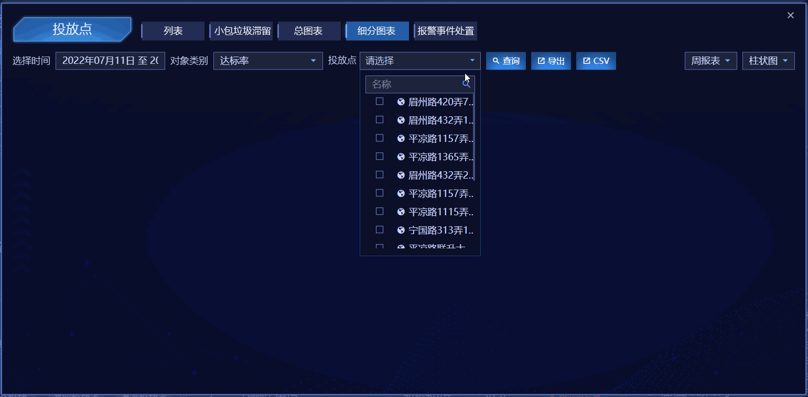  

数据以X,Y轴的图表形式展现。 

以对象类别为评分举例，两个投放点的周报表柱状示意图： 

X轴是周一至周日分段，Y轴是以0分-100分为分段。 

鼠标放在柱状图上，会显示投放点名称，X轴数据，Y轴数据。 

 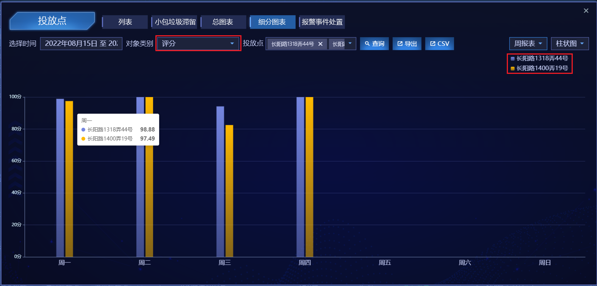 

月报表下的投放点评分 

 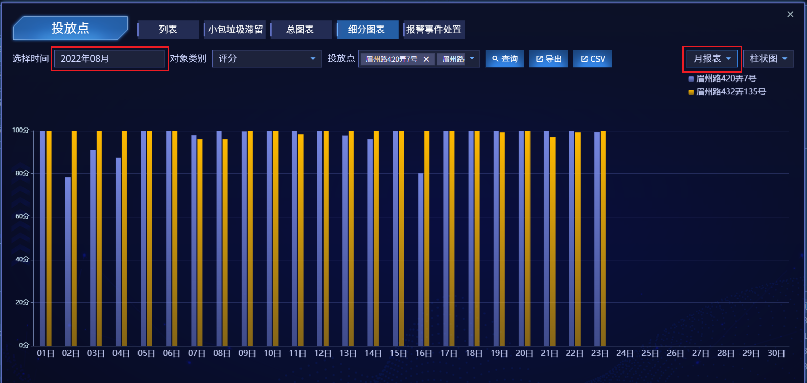 

以对象类别为平均落地时长举例，两个投放点的周报表柱状示意图： 

X轴是周一至周日分段，Y轴是以分钟为单位分段。 

 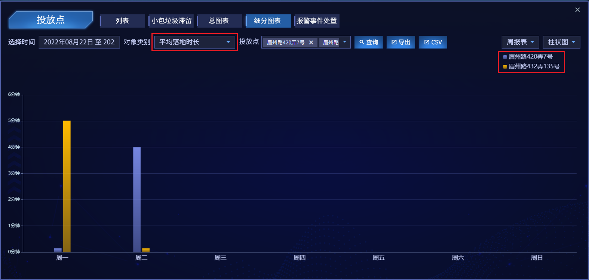 

月报表下的投放点平均落地时长 

 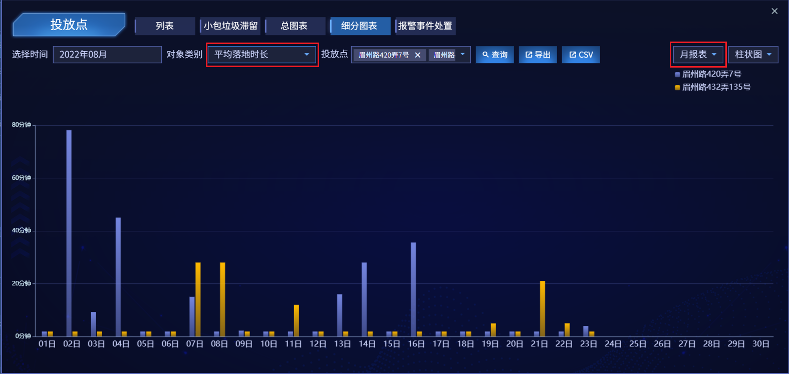 

以对象类别为最大落地时长举例，两个投放点的周报表柱状示意图： 

X轴是周一至周日分段，Y轴是以分钟为单位分段。 

 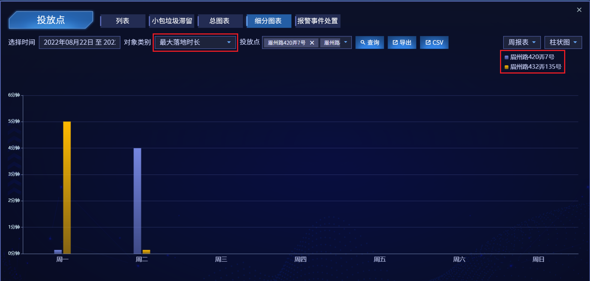 

月报表下的投放点最大落地时长 

 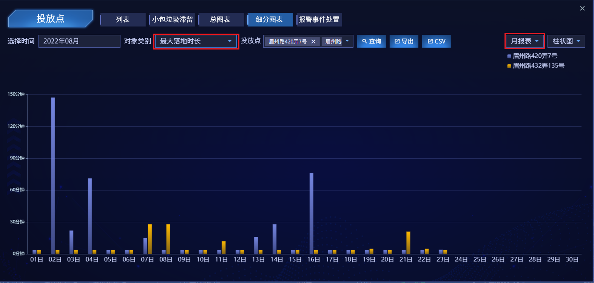 

以对象类别为总落地时长举例，两个投放点的周报表柱状示意图： 

X轴是周一至周日分段，Y轴是以分钟为单位分段。 

 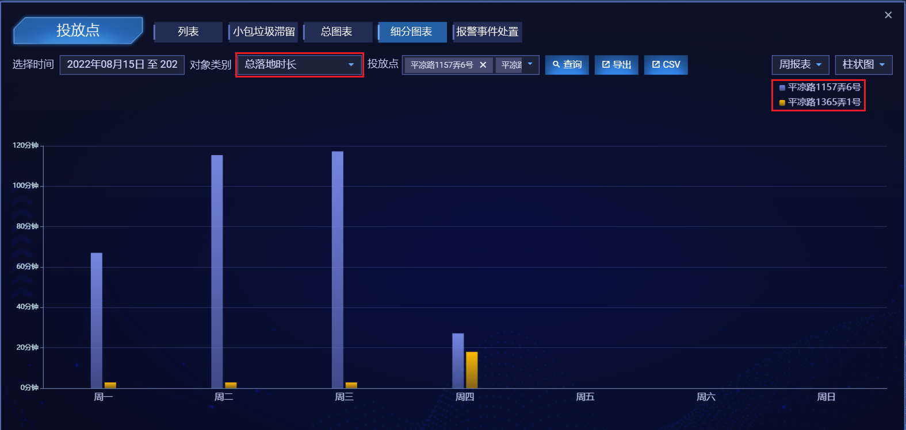 

月报表下的投放点总落地时长 

 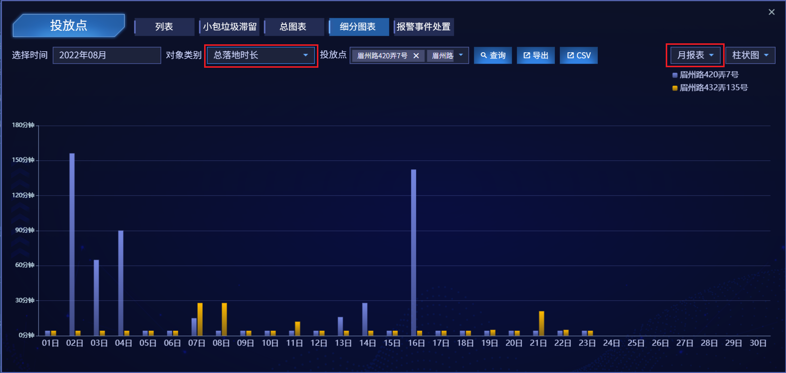 

以对象类别为垃圾落地举例，两个投放点的周报表柱状示意图： 

X轴是周一至周日分段，Y轴是以起为单位分段。 

  

月报表下的投放点垃圾落地数量统计 

 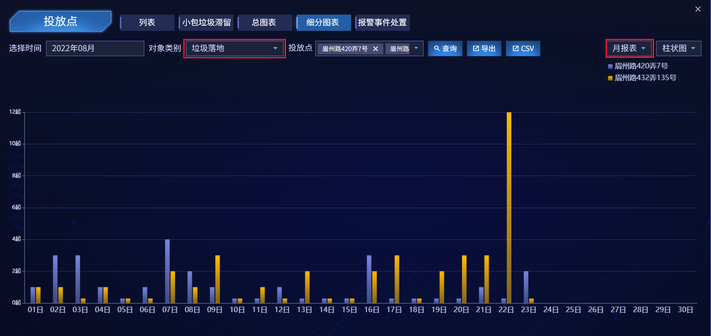 

以对象类别为混合投放举例，两个投放点的周报表柱状示意图： 

X轴是周一至周日分段，Y轴是以起为单位分段。 

 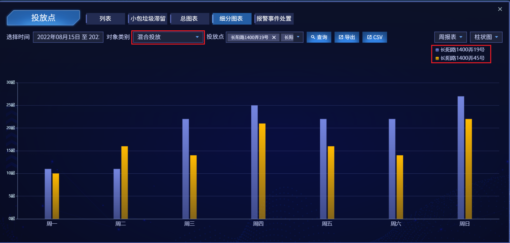 

月报表下的投放点混合投放数量统计 

 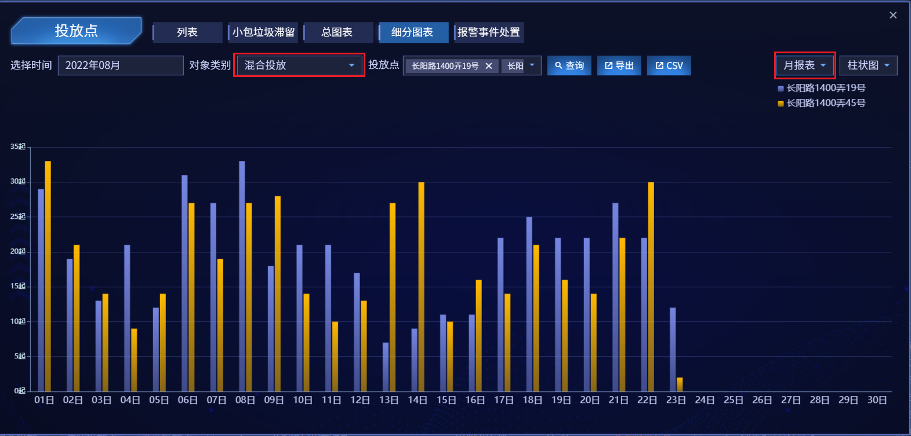 

点击   ，切换折线图。 

	折现图展示

	横轴显示当月的天数，纵轴显示小包垃圾的达标率（没有垃圾落地的时间/总时间*100）
 
 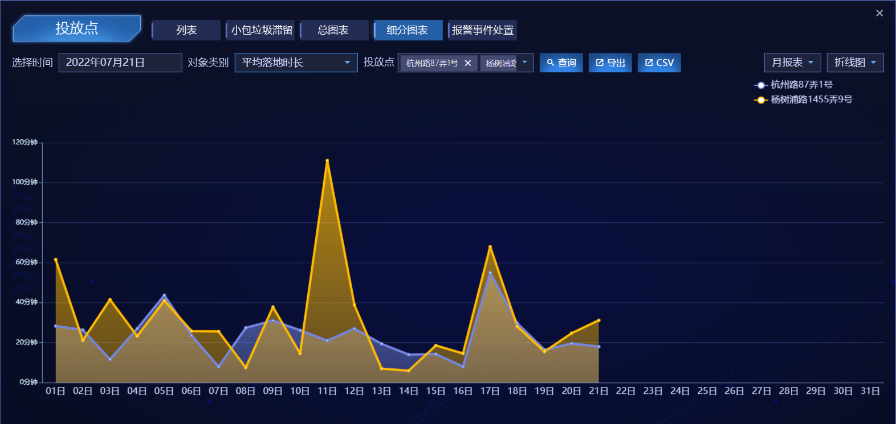  

	日期栏-选择需要的日期

参考 汇总信息中的日期操作：[3.1](#3-1) 

 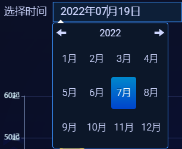  

	对象类别-切换细分图表的显示条件
	分别是：评分，平均落地时长，最大落地时长，总落地时长，垃圾落地和混合投放。

 
 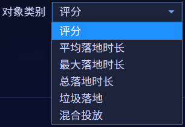  

<b>2.6.4.5  报警事件处置 </b>

	切换报警事件处置
	展示滞留垃圾事件处置状态和相关信息，发送时间，处置时间，并统计滞留时长
	工单号为报警事件唯一号码，可通过搜索工单号精准查询事件
	发送时间：事件发生的时间。
	处置时间：将事件中的垃圾处理完毕时间。
	滞留时长：处置时间-发送时间
	状态：待处置，已处置，超时待处置，超时处置
	
 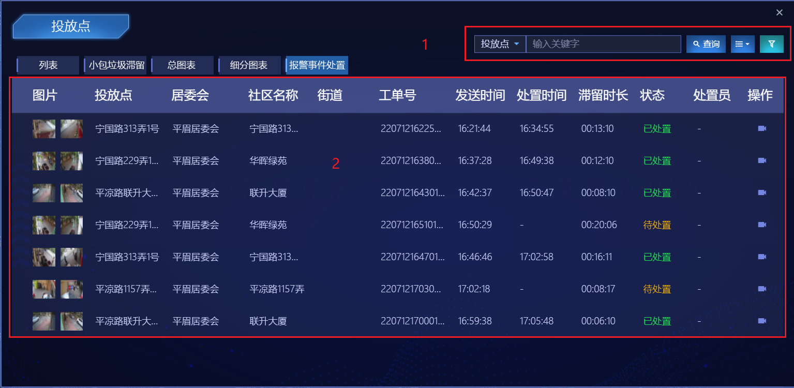  

1. 搜索框 

2. 信息区域 

<b>2.6.4.5.1  搜索框 </b>

   

输入投放点名称，点击查询，查询事件详细信息。 

获取事件唯一工单号，产生小包垃圾后的发送时间，处理完小包垃圾的处置事件和两个时间差的滞留时长。 

处置状态（待处置，已处置，超时待处置，超时处置），操作视频以查阅事件视频。 

 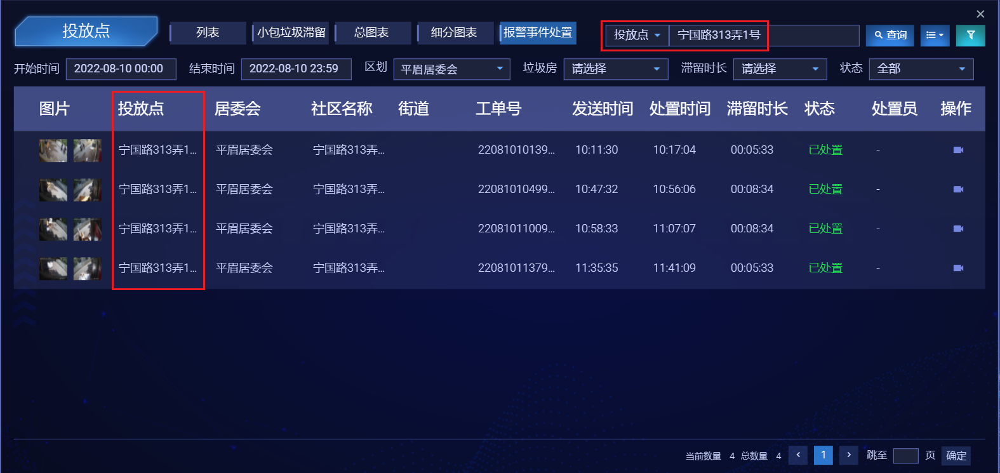 
 

输入社区名称，点击查询，查询事件详细信息。 

  

查阅视频请参见：[摄像机信息](#2-6-1-2)

事件列表 

以列表的形式，展示事件的发生时间，处理时间，处置员等相关信息。 

  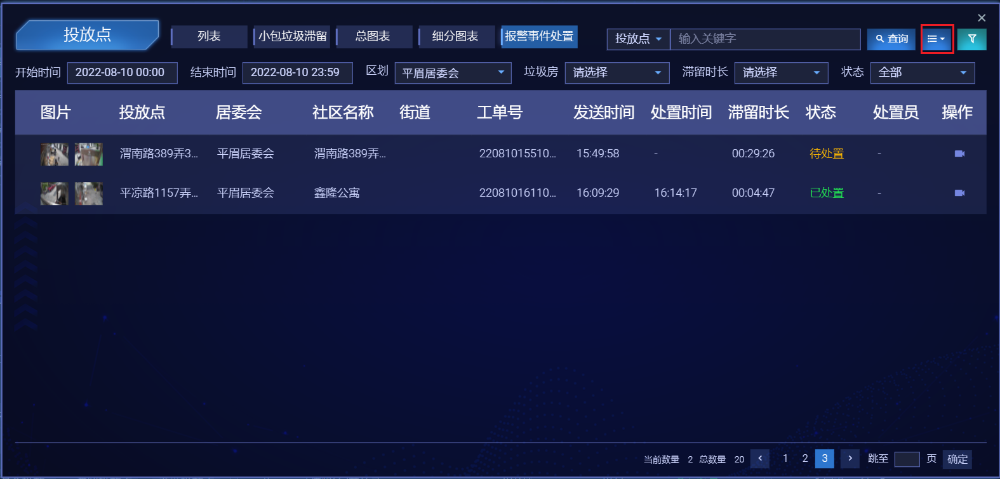 

任务处置界面，快速查看投放点和居委下的任务数量，未完成任务数量，超时处置数量以及处置率。 

可以将数据以Excel文件导出。 

  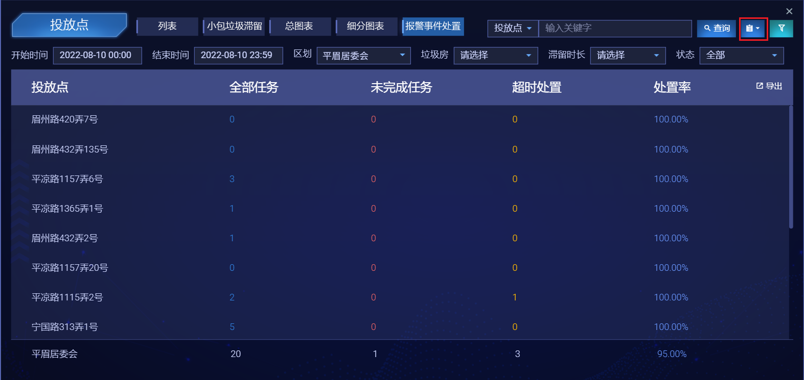 

导出按键 

  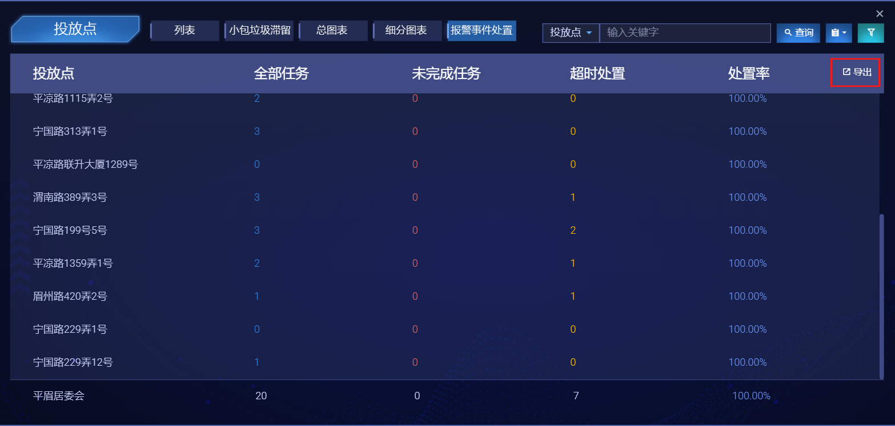 

导出文件展示 

   

显示居委会的任务数量/处置率，以及各个投放点下的任务数量/处置率。 

  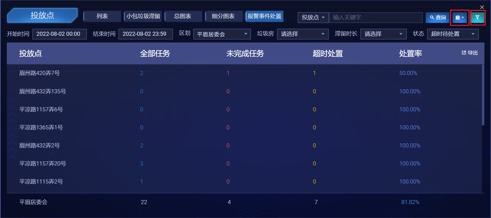  

	搜索条件扩展，可以根据需求精准查询。

点击  ,展开搜索条件扩展栏。

 

开始时间：0：00-24：00，24个时间段。 
结束时间：0：00-24：00，24个时间段。 
区划：居委会名称。 
垃圾房：投放点名称。 
滞留时长：30分钟内，30分钟-1小时，1小时-2小时，2小时以上。参见：[2.8](#2-8) 
状态：待处置，已处置，超时待处置，超时处置。参见：[2.8](#2-8) 

 

<b>2.6.5 垃圾落地 </b>

   

 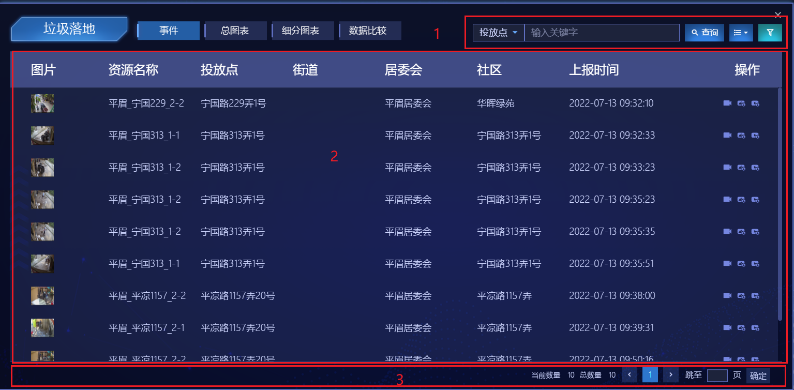  

1. 搜索框  功能参见投放点下的搜索框:[搜索框](#2-6-4-5-1) 
2. 垃圾落地详细信息 
3. 落地垃圾数量及翻页功能 
 

垃圾落地播放视频/下载图片/下载视频操作 

  

播放视频效果图 

  

下载图片效果图 

 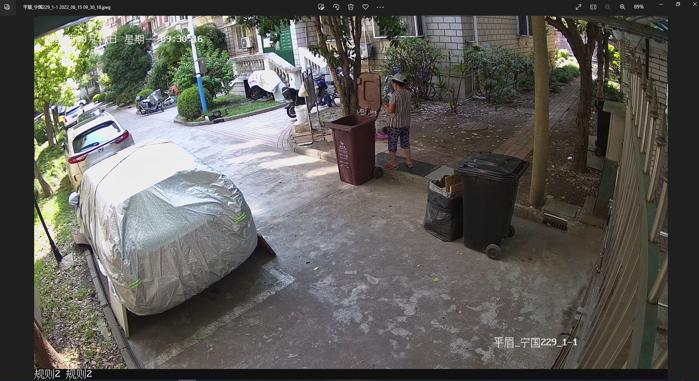 

下载视频动态图 

  

 

<b>2.6.6 混合投放 </b>

   

	

   

1. 搜索框  功能参见投放点下的搜索框:[搜索框](#2-6-4-5-1) 
2. 垃圾落地详细信息 
3. 落地垃圾数量及翻页功能 
 

操作部分可参考**垃圾落地**：[2.6.5](#2-6-5) 

<b>2.6.7 滞留投放点 </b>

  

展开滞留投放点信息。 

 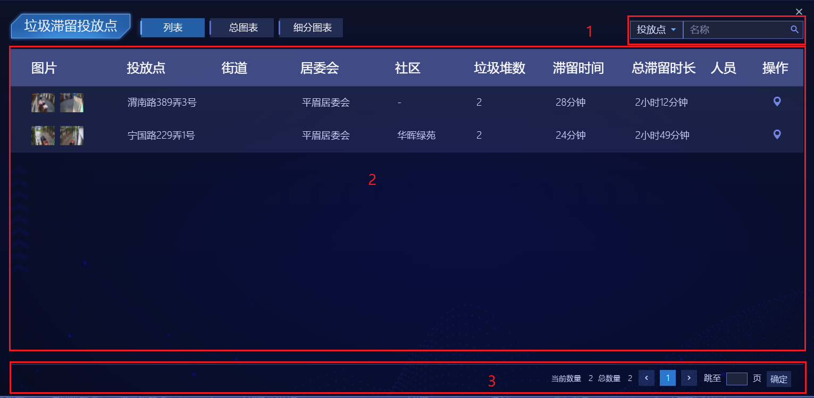 

 其他相关操作可参考**投放点**：[2.6.4](#2-6-4)  

<b>2.6.8 满溢投放点 </b>

   

展开满溢投放点列表和事件。 

   

<b>2.7  投放点设备监控视频</b>

   

1.投放点名称 

2.刷新/全屏 

3.进入下一个投放点监控视频或倒退上一个投放点监控视频 

4.当前投放点排名/投放点总数 

投放点设备全屏展示图 

 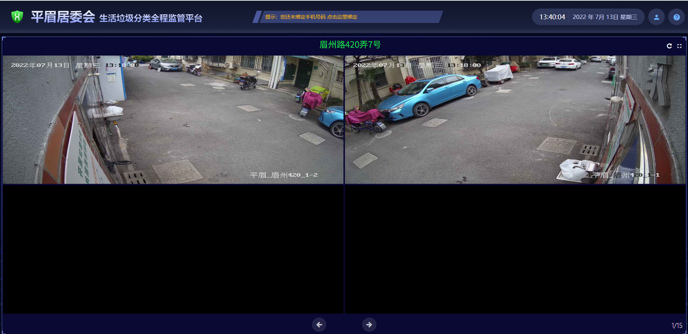  

投放点设备播放视频展示图 

点击  回放视频 

 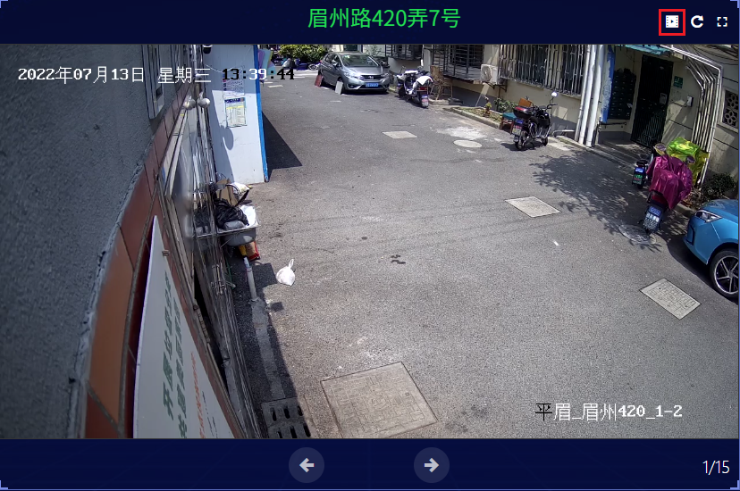  

回放视频展示图 

根据需求选择回放日期，开始时间和结束时间。 

点击开始回放或取消。 

 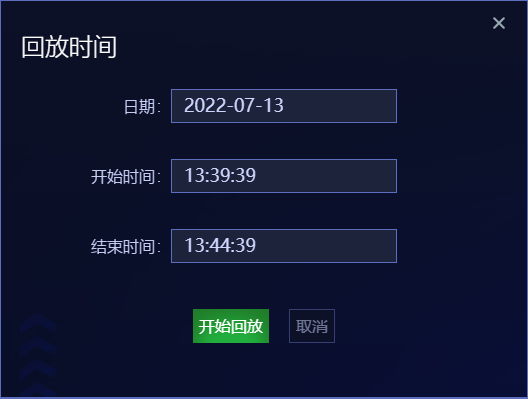  

回放视频预览图。 

 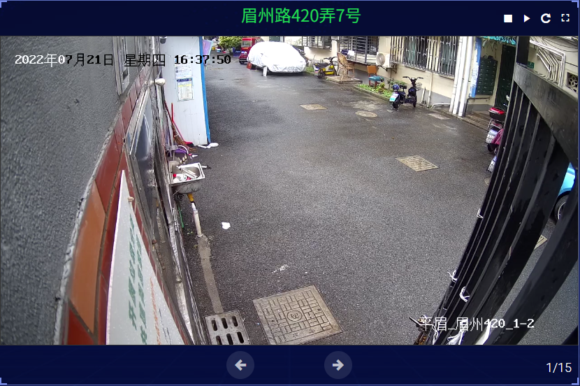 

  停止视频 

  返回预览 

  刷新 

  全屏 

 
 

<b>2.8 滞留垃圾事件概况 </b>

 方便查看整个居委事件状态，将事件重要信息在此处展示。 

 下图展示投放点名称，处置人员，时长，时间和状态信息。 

 可以点击事件，查看事件信息。 

 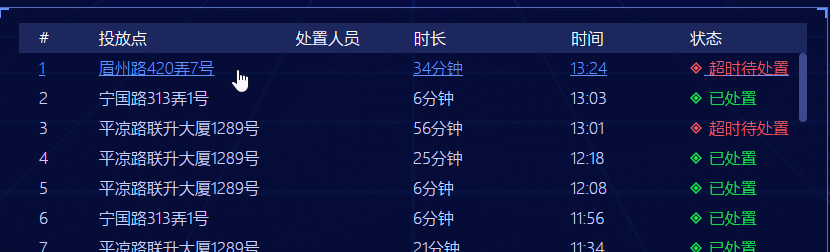  

 点击投放点，展示详细事件信息。 

  

其中，报警事件处置状态有待处置，已处置，超时待处置，超时处置。 

 ：检测区域内发现滞留垃圾，显示事件为待处置状态。   

待处置状态下，投放点下的摄像机均拍摄一张垃圾滞留图片  

`平眉_眉州432_2-1` 摄像机拍摄的一张垃圾滞留图片  

 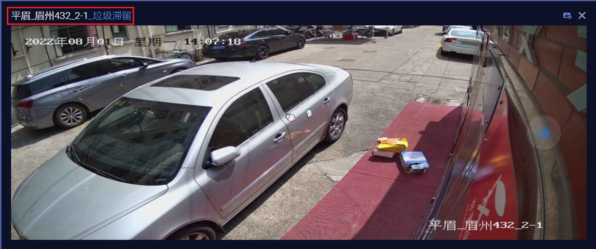 

  ：已将滞留垃圾处置完毕，显示事件为已处置状态。   

已处置状态下，投放点下的摄像机均拍摄一张垃圾滞留图片和已处置图片。  

`平眉_宁国313_1-1` 摄像机拍摄的一张垃圾滞留图片。  

 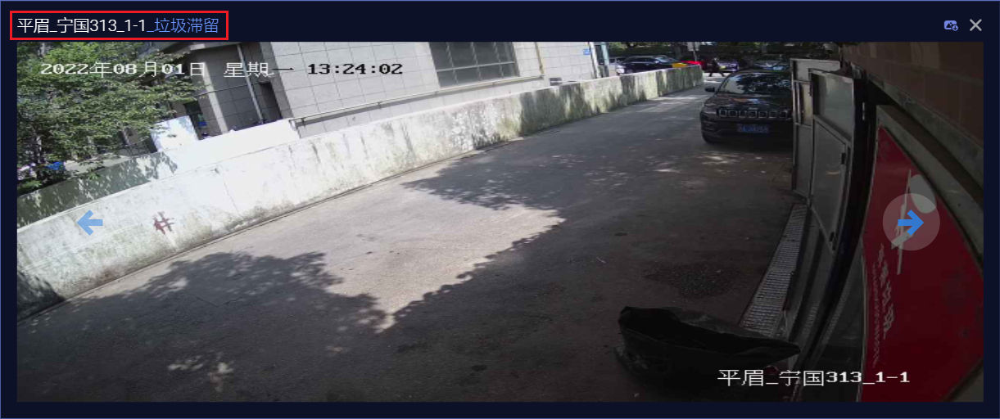 

`平眉_宁国313_1-1` 摄像机拍摄的一张垃圾已处置图片。  

 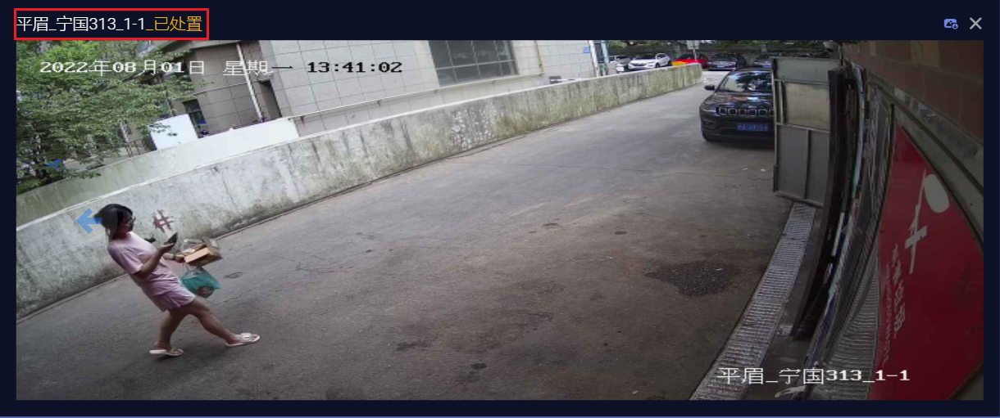 

 ：滞留垃圾超过40分钟后处置的，显示事件为滞留垃圾超时处置状态。  

超时处置状态下，投放点下的摄像机均拍摄一张垃圾滞留图片，超时未处置图片和已处置图片。  

`平眉_渭南389_1-1` 摄像机拍摄的一张垃圾滞留图片。  

 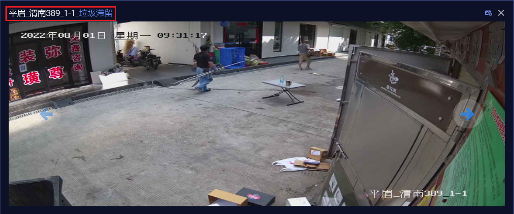 

`平眉_渭南389_1-1` 摄像机拍摄的一张垃圾超时未处置图片。  

 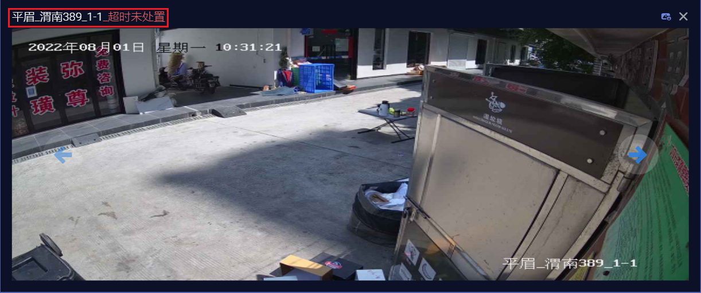 

`平眉_渭南389_1-1` 摄像机拍摄的一张垃圾已处置图片。  

 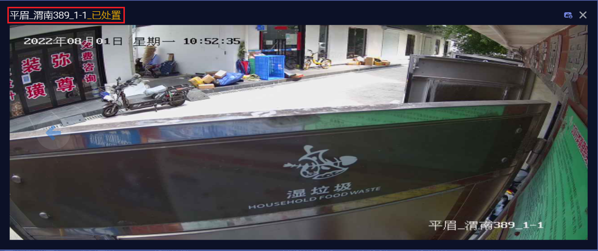 

  ：滞留垃圾超过40分钟后未处置的，显示事件为滞留垃圾超时未处置状态。 

超时未处置状态下，投放点下的摄像机均拍摄一张垃圾滞留图片和超时未处置图片。  

`平眉_宁国229_2-1` 摄像机拍摄的一张垃圾滞留图片。  

 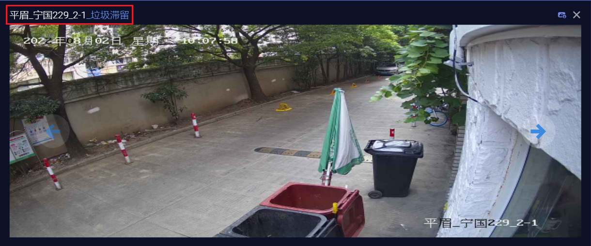 

`平眉_宁国229_2-1` 摄像机拍摄的一张垃圾超时未处置图片。  

 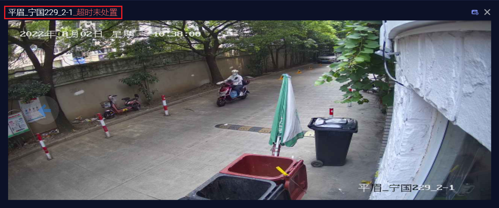 

点击  图标，弹出事件视频。 

 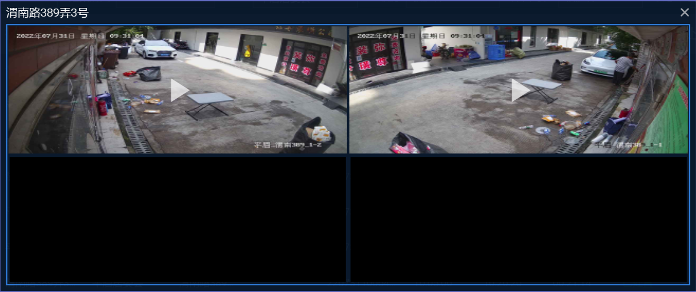 

 

<b>2.9 垃圾落地排名/混合投放排名 </b>

 

垃圾落地：检测区域内侦测到有乱丢垃圾的行为。  

混合投放：未按垃圾分类要求投放垃圾。

 统计将该居委下的投放点的事件数量，并进行排位 

垃圾落地/混合投放数量越多，排名越靠前。 

垃圾落地/混合投放数量越少，排名越靠后。 

 分垃圾落地/混合投放两类,右上方功能键切换，如图所示： 

   

 进入投放点，查看落地垃圾详细信息参考：统计数据的垃圾落地部分：[2.4.5](#2-4-5) 
 进入投放点，查看混合投放详细信息参考：统计数据的混合投放部分：[2.4.6](#2-4-6) 

   

<b>2.10  垃圾滞留时长排名 </b>

	此部分统计各投放点滞留垃圾的时长，并进行排名。
	滞留垃圾时间越长，投放点排名越靠前。
	滞留垃圾时间越短，投放点排名越靠后。
 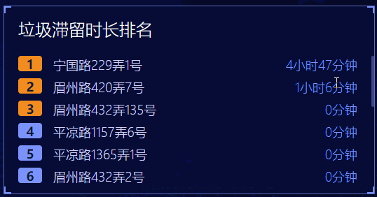  

 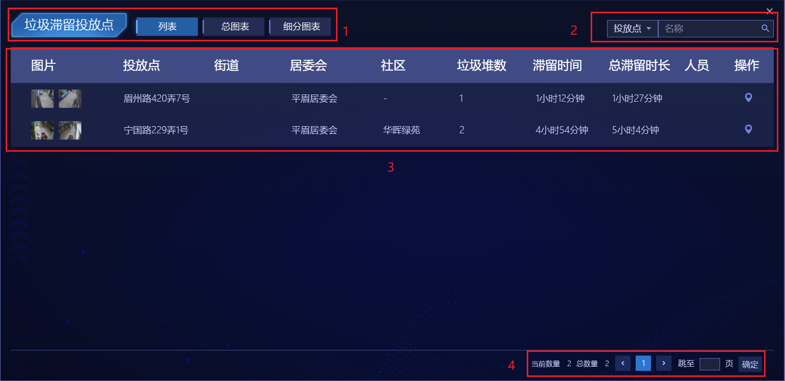  

进入投放点以查看详细信息 

1.垃圾滞留投放点的信息列表。 

2.搜索功能栏。 

3.投放点的滞留垃圾图片，滞留时间，总滞留时长等信息。 

4.跳转/翻页区域。 

 

<b>2.11 垃圾落地/混合投放事件 </b>

 此部分可查看所有垃圾落地事件和混合投放事件 

 在操作部分可迅速查看事件图片/视频 

 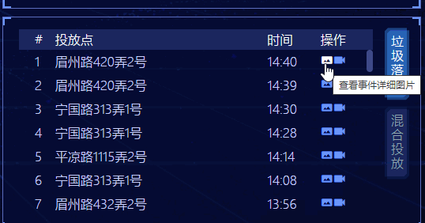  

 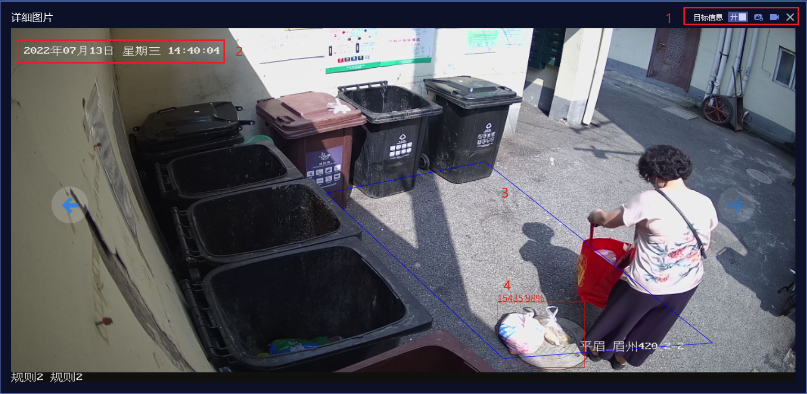  

	事件图片展示
	 1.图片功能区
	 2.日期，时间显示区
	 3.垃圾落地预警区
	 4.垃圾落地报警，置信度显示
 

 事件视频展示 

 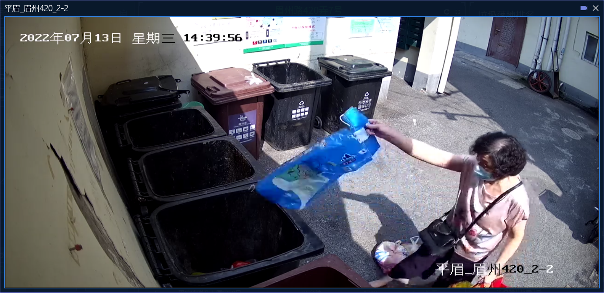  

<b>2.12  附件 </b>

附件： 

设备监控视频 

点击  功能键分别是-目标信息开/关；下载视频；下载图片；视频回放；关闭。 

打开目标信息时，显示检测区域（蓝框内），检测目标（红框内），置信度（红色百分比数字）。 

 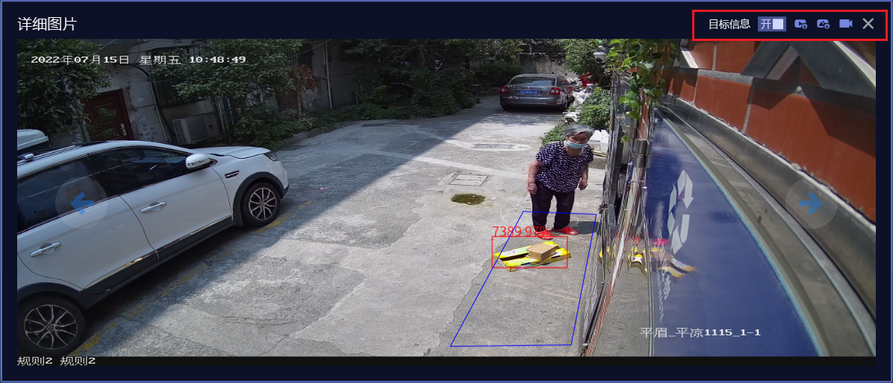  

前进/后退 键，用来图片翻页，查看其他垃圾落地事件。 

 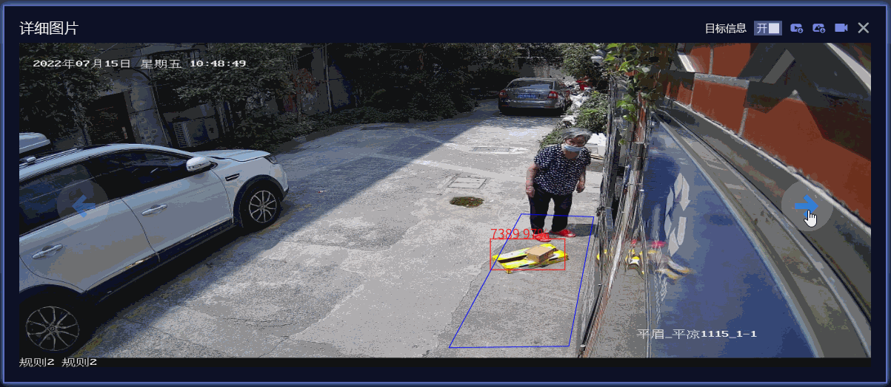  

-------------------------------------------------------------------------------------------------

<b>三、 汇总信息</b>

点击汇总信息 	，弹出居委汇总信息页面。

 

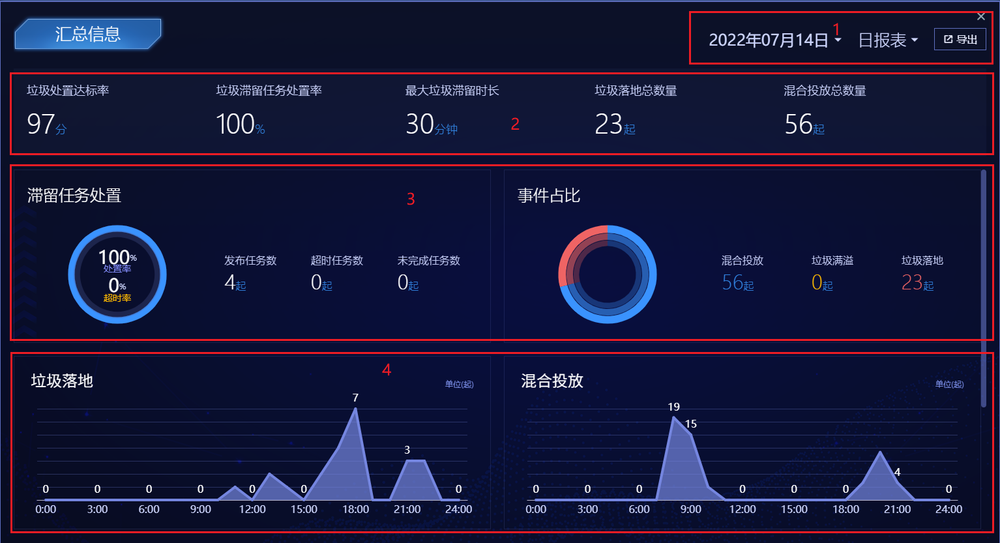 

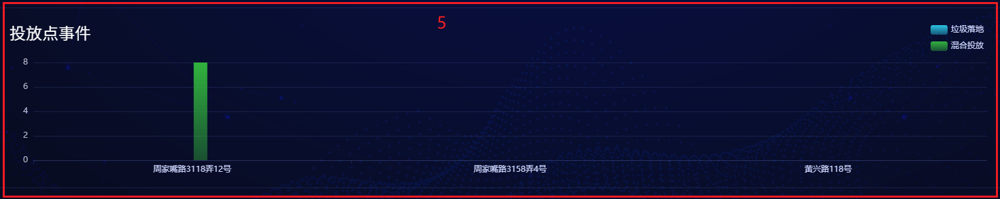 

		1. 日期，日报表/月报表，导出数据
    	2. 垃圾处置达标率，垃圾滞留任务处置率，最大垃圾滞留时长，垃圾落地总数量，混合投放总数量
		3. 滞留任务处置
		4. 垃圾落地/混合投放
		5. 投放点事件
 
 

<b>3.1 日期，日报表/月报表，导出数据 </b>

 	

点击   中的日期。 

在日报表的状态下，展开年/月/日信息，可以直接在表中选择日期。 

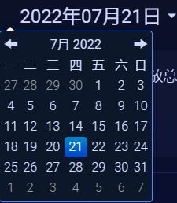 

点击  后退至上个年/月。 

点击  前进至下个年/月。 

点击 选择月份。 
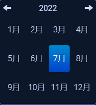 

点击 选择年。 
 

---------------------------------------------------------------

点击日报表/月报表切换。 	

 

在月报表下，选择月/日。 	

点击 选择月份。 
 

点击 选择年。 
 

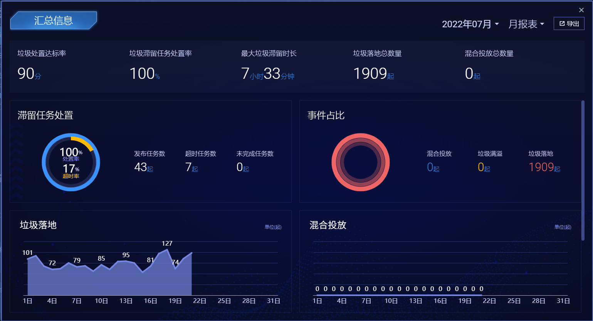 

点击  导出页面上的数据。 

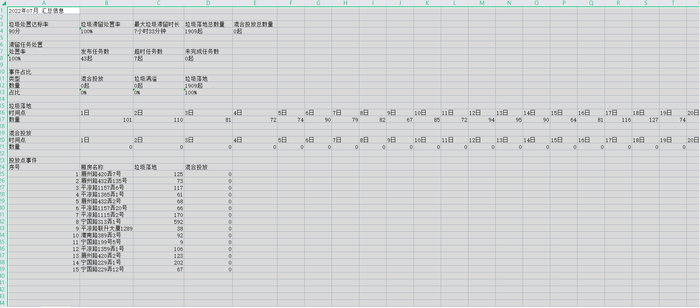 

 
 

<b>3.2 主要指标 </b>

 	
 

垃圾处置达标率：当天垃圾处置数量占总垃圾落地的数量的分数，评分越高代表处置越及时，评分越低代表处置不及时 
评分标准为100分减去垃圾滞留时长除以垃圾滞留总时长*100	 

垃圾滞留任务处置率：当天滞留垃圾的处置数量占总滞留垃圾的高境数量的百分比。 	

最大垃圾滞留时长：当天处置花费时间最长的滞留事件。 

垃圾落地总数量：当天垃圾落地事件的总数量。 

混合投放总数量：当天混合投放垃圾事件的总数量。 

 

<b>3.3 滞留任务处置 </b>

 	

处置率：完成任务数占总发布任务数的百分比。 

超时率：超时任务数占总发布任务数的百分比。 

图中总发布任务数6起，超时任务数2起，未完成任务数3起，所以处置率为50%，超时率为34% 

 

 

<b>3.4 事件占比 </b>

 

下图混合投放29起，垃圾满溢0起，垃圾落地7起。 

点击饼图显示各个事件的百分比。 

 

 

 

<b>3.5 垃圾落地/混合投放 </b>

垃圾落地折线图 

折现图展示当天24小时内垃圾落地数量，横轴为时间，以小时为单位。纵轴是垃圾落地的数量，以起为单位。 

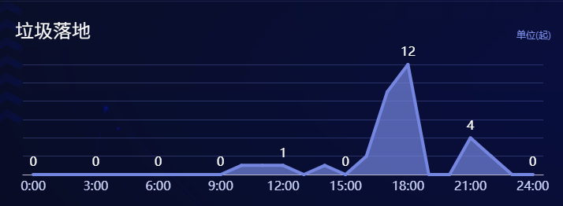 
	

混合投放折线图 
折现图展示当天24小时内混合投放垃圾数量，横轴为时间，以小时为单位。纵轴是混合投放垃圾的数量，以起为单位。 

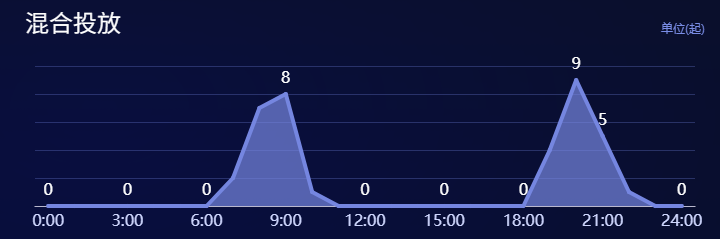 

 

<b>3.6 投放点事件 </b>

柱状图展示该居委下三个投放点的垃圾落地事件和混合投放事件的数量。 
横轴是居委下的3个投放点，纵轴为数量（单位为起）。 

 

 

<b>3.7 月报表 </b>

月报表的主要指标参考：[3.2](#3-2)
滞留任务处置参考：[3.3](#3-3)
事件占比请参考：、[3.4](#3-4)
投放点事件请参考：、[3.6](#3-6)

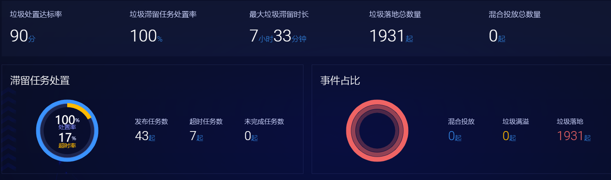 

 

<b>3.7.1 垃圾落地 </b>

月报表中的垃圾落地事件图表，横轴平均分布1日-31日，纵轴为垃圾落地数量/日。 

鼠标移至图表上后，提示日期和垃圾落地数量（单位是起）。 

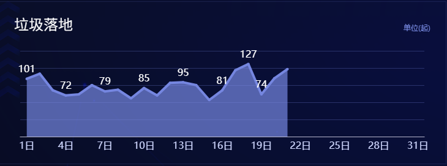 
 

<b>3.7.2 混合投放 </b>

月报表中的混合投放垃圾事件图表，横轴平均分布1日-31日，纵轴为垃圾落地数量/日。 

鼠标移至图表上后，提示日期和混合投放垃圾数量（单位是起）。 

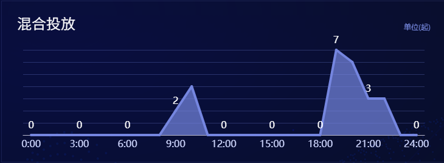 
 

<b>3.7.3 投放点事件 </b>

投放点事件统计月数据 

柱状图展示该居委下8个投放点的垃圾落地事件和混合投放事件的数量。 
横轴是居委下的8个投放点，纵轴为数量（单位为起）。 

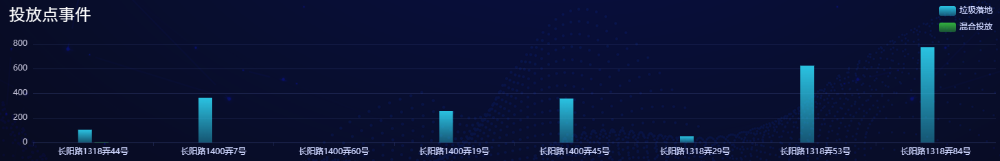 